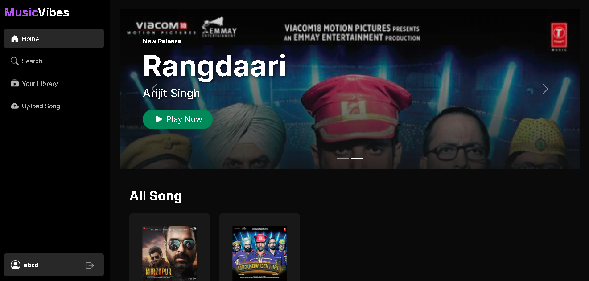

# 🎵 Music Vibes

Modern full-stack music library web application built with React.js, Node.js, Express.js, and MongoDB featuring responsive UI, secure authentication, music management, and smooth user experience.

---

## 🚀 Features

- Secure authentication
- Music upload & management
- Responsive modern UI
- Search functionality
- MongoDB integration
- Smooth navigation

---

## 🛠 Tech Stack

React.js • Node.js • Express.js • MongoDB • JavaScript • CSS3

---

## 📄 Documentation

Detailed project documentation and additional screenshots are included in the repository.

---

## 🔐 Security Notice

Sensitive configuration files and private modules are excluded from the public repository for security purposes.

## 👨‍💻 Author

Pratik Creates

---

## 📸 Screenshots

###  Home Preview

###  Search Section

###  Upload Section

###  Responsive Section

---

---
